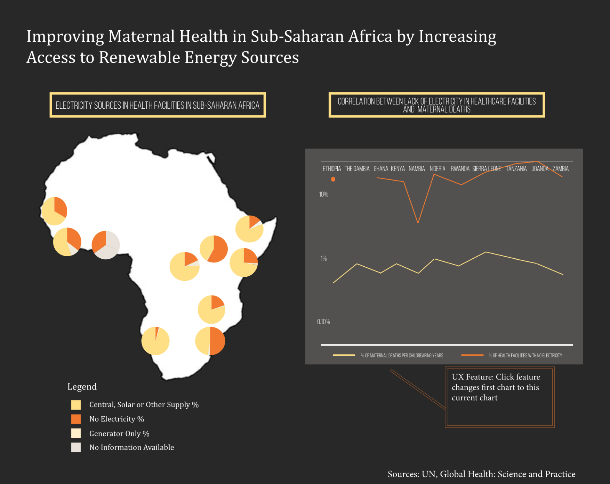

Through the lens of SDG-5 (Gender Equality), this visualization examines the importance of dependable energy in healthcare facilities and its role in reproductive care in sub-Saharan Africa. It also explores the direct correlation between maternal mortality rates and a lack of electricity in healthcare facilities in sub-Saharan Africa</h4>

Without dependable energy in healthcare facilities, women experience a range of complications including but not limited to, giving birth in the dark without access to lifesaving devices requiring electricity.

Initiatives that focus on investing in dependable energy in this area will have a direct impact in saving women's lives.

